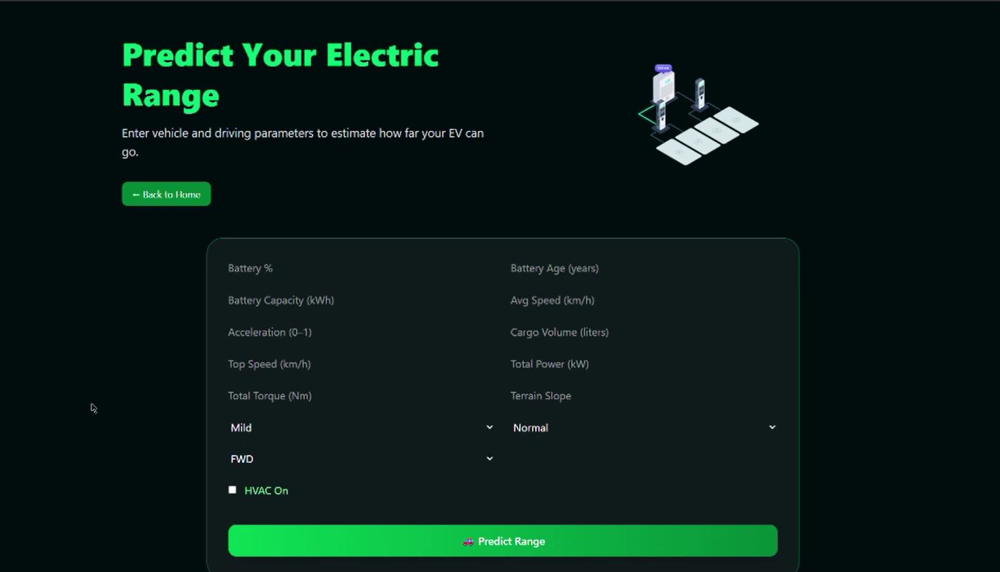
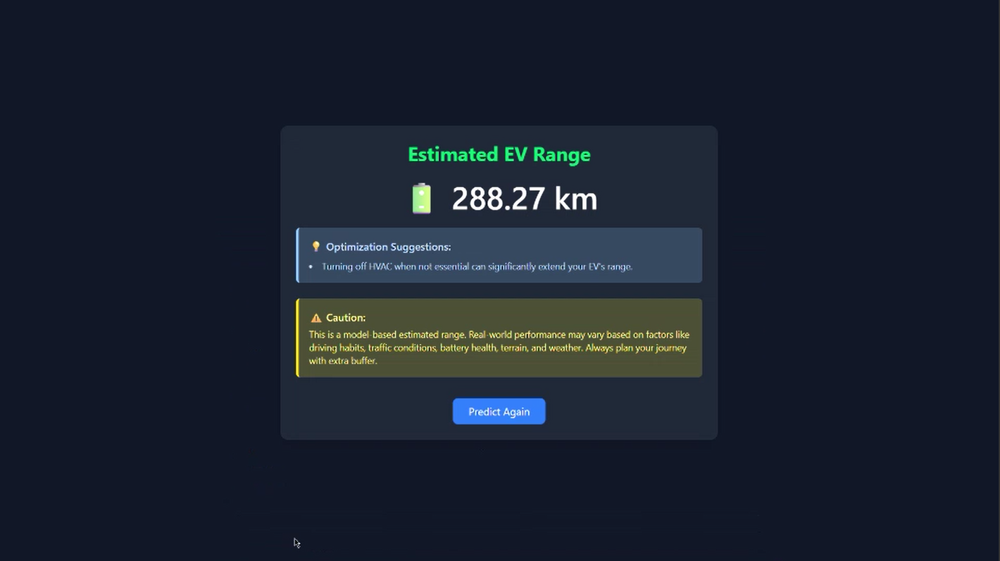
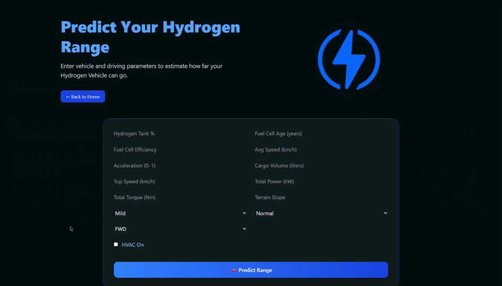
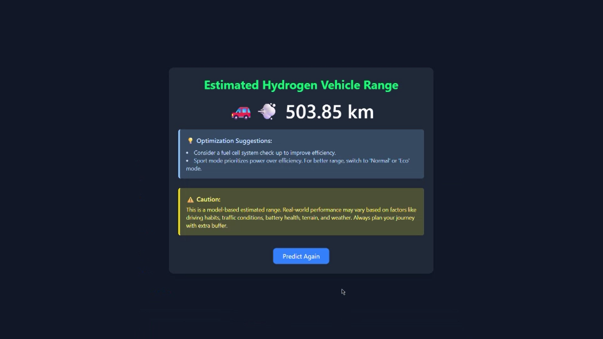

# 🌱 Green-Miles

**Green-Miles** is an intelligent system that promotes sustainable mobility by analyzing and predicting vehicle range and energy efficiency for electric and hydrogen vehicles.  
It combines machine learning models, data preprocessing pipelines, and a user-friendly frontend to help users make environmentally conscious transportation decisions.

---

## ⚙️ Tech Stack

### **Backend**

- **Language:** Python
- **Framework:** FastAPI
- **Machine Learning:** XGBoost, Scikit-Learn, NumPy, Pandas
- **Data Handling:** Pydantic (Schemas), Custom Preprocessing Scripts
- **API Routing:** FastAPI Routers (under `/routes`)

### **Frontend**

- **Framework:** React.js
- **Styling:** Tailwind CSS
- **HTTP Client:** Axios / Fetch API
- **Build Tool:** Vite

---


## 🚀 Setup Instructions

Follow these steps to get the project running locally:

### Prerequisites

- Node.js & npm / yarn (for frontend)
- Python (version x.x) & pip / venv (for backend)
- Git

### Steps

1. **Clone the repository**
   git clone https://github.com/shashankbharadwaj27/GreenMiles.git
   cd Green-Miles
2. **Backend**
    cd Backend
    python -m venv venv
    venv\Scripts\activate
    pip install -r requirements.txt
    uvicorn main:app --reload
3. **Frontend**
    cd Frontend
    npm install
    npm start
4. **Access application**
    Open browser and go to http://localhost:3000
    The frontend will communicate with backend


### ScreenShots

**Homepage**


**EV Page**


**EV Result Page**


**HV Page**


**HV Result Page**



## Folder Structure

```
Green-Miles/
├── Backend/
│ ├── agents/
│ ├── data/
│ ├── models/
│ ├── preprocess/
│ ├── routes/
│ ├── schemas/
│ ├── scripts/
│ ├── utils/
│ ├── requirements.txt
│ └── main.py
├── Frontend/
│ ├── src/
│ │ ├── pages
│ │ └── assets
│ ├── index.html
│ ├── package.json
│ └── ... (other frontend config)
├── .gitignore
└── README.md
```
